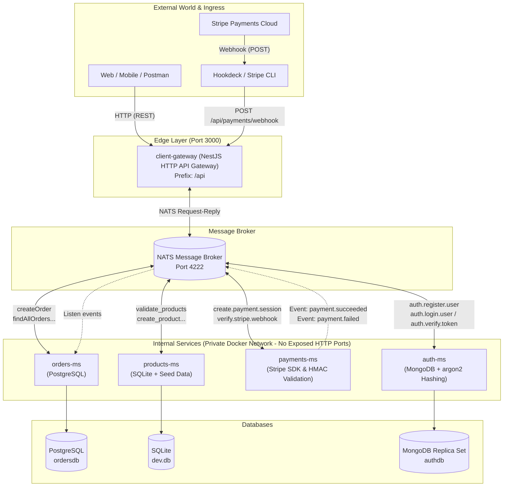

# Products App (Products Launcher)

Docker environment and multi-repo orchestrator for a distributed NestJS microservices application.

The architecture follows the **API Gateway Pattern** with **Event-Driven Microservices** powered by **NATS Messaging**, PostgreSQL, SQLite, MongoDB, and Stripe payment processing. All external HTTP traffic is strictly funneled through the API Gateway, leaving internal microservices fully private and decoupled.

---

## System Architecture



---

## Services Overview

| Service              | Responsibility                                                                                                                                                  | Network & Port Visibility                       |
| :------------------- | :-------------------------------------------------------------------------------------------------------------------------------------------------------------- | :---------------------------------------------- |
| **`client-gateway`** | **Single Inbound HTTP API Gateway** for all external traffic (`/api/products`, `/api/orders`, `/api/payments`). Communicates with workers exclusively via NATS. | Exposed to Host: `CLIENT_GATEWAY_PORT` → `3000` |
| **`products-ms`**    | Product catalog & price validation. Uses SQLite persisted in Docker volumes with automatic 47-item seed.                                                        | **Private** (Internal NATS only)                |
| **`orders-ms`**      | Order management, lifecycle state machine (`PENDING`, `PAID`, `CANCELLED`), and transaction receipt storage.                                                    | **Private** (Internal NATS only)                |
| **`payments-ms`**    | Stripe Checkout session creation, raw body HMAC-SHA256 signature verification, and payment event dispatching.                                                   | **Private** (Internal NATS only)                |
| **`auth-ms`**        | User registration & login with **argon2** password hashing and token verification.                                                                              | **Private** (Internal NATS only)                |
| **`nats-server`**    | High-performance publish/subscribe and request-reply message broker.                                                                                            | Port `4222`, Monitoring `8222`                  |
| **`orders-db`**      | Orders PostgreSQL database.                                                                                                                                     | Port `127.0.0.1:5432`                           |
| **`auth-db`**        | Auth MongoDB database (single-node replica set with keyfile auth, initialized by a one-shot `auth-db-init` container).                                          | Port `127.0.0.1:${AUTH_DB_PORT:-27017}`         |

---

## API Endpoints (Gateway HTTP)

All public endpoints are accessible through the Gateway base URL: `http://localhost:3000/api` (or `CLIENT_GATEWAY_PORT`).

### 🛍️ Products (`/api/products`)

| Method   | Endpoint            | Payload / Query                          | Target NATS Pattern | Description                         |
| :------- | :------------------ | :--------------------------------------- | :------------------ | :---------------------------------- |
| `POST`   | `/api/products`     | `CreateProductDto` (`{ name, price }`)   | `create_product`    | Creates a new product               |
| `GET`    | `/api/products`     | `PaginationDto` (`?page=1&limit=10`)     | `find_all_products` | Retrieves paginated active products |
| `GET`    | `/api/products/:id` | -                                        | `find_one_product`  | Retrieves single product by ID      |
| `PATCH`  | `/api/products/:id` | `UpdateProductDto` (`{ name?, price? }`) | `update_product`    | Updates product details             |
| `DELETE` | `/api/products/:id` | -                                        | `delete_product`    | Soft-deletes a product              |

### 📦 Orders (`/api/orders`)

| Method  | Endpoint              | Payload / Query                                           | Target NATS Pattern                      | Description                                                                                                                            |
| :------ | :-------------------- | :-------------------------------------------------------- | :--------------------------------------- | :------------------------------------------------------------------------------------------------------------------------------------- |
| `POST`  | `/api/orders`         | `CreateOrderDto` (`{ items: [{ productId, quantity }] }`) | `createOrder` ➔ `create.payment.session` | Creates order in PostgreSQL, validates items with Products, and creates Stripe Checkout session (returns order + `paymentSession.url`) |
| `GET`   | `/api/orders`         | `OrderPaginationDto` (`?page=1&limit=10&status=...`)      | `findAllOrders`                          | Retrieves paginated orders                                                                                                             |
| `GET`   | `/api/orders/id/:id`  | -                                                         | `findOneOrder`                           | Retrieves single order by UUID with populated item names & prices                                                                      |
| `GET`   | `/api/orders/:status` | `PaginationDto` (`?page=1&limit=10`)                      | `findAllByStatus`                        | Retrieves orders filtered by status (`PENDING`, `PAID`, `DELIVERED`, `CANCELLED`)                                                      |
| `PATCH` | `/api/orders/:id`     | `StatusDto` (`{ status }`)                                | `changeOrderStatus`                      | Updates order status manually                                                                                                          |

### 💳 Payments (`/api/payments`)

| Method | Endpoint                | Payload / Headers                    | Target NATS Pattern     | Description                                                                                       |
| :----- | :---------------------- | :----------------------------------- | :---------------------- | :------------------------------------------------------------------------------------------------ |
| `POST` | `/api/payments/webhook` | Raw Body + `stripe-signature` Header | `verify.stripe.webhook` | Ingests Stripe webhook, encodes payload to base64, and delegates HMAC validation to `payments-ms` |
| `GET`  | `/api/payments/success` | -                                    | Local Gateway response  | Redirect landing page after successful checkout                                                   |
| `GET`  | `/api/payments/cancel`  | -                                    | Local Gateway response  | Redirect landing page when payment is canceled or aborted                                         |

### 🔐 Auth (`/api/auth`)

| Method | Endpoint             | Payload                                         | Target NATS Pattern  | Description                                                        |
| :----- | :------------------- | :---------------------------------------------- | :------------------- | :----------------------------------------------------------------- |
| `POST` | `/api/auth/register` | `RegisterUserDto` (`{ name, email, password }`) | `auth.register.user` | Registers a new user; passwords are hashed with **argon2**         |
| `POST` | `/api/auth/login`    | `LoginUserDto` (`{ email, password }`)          | `auth.login.user`    | Validates credentials against MongoDB and returns the user payload |
| `POST` | `//api/auth/verify`  | `{ token }`                                     | `auth.verify.token`  | Verifies an authentication token                                   |

> [!NOTE]
> Token issuance currently returns a placeholder value (`JWT_PENDING`): real JWT signing/verification is still pending implementation in `auth-ms`.

---

## Internal NATS Contracts

### Request-Reply Patterns (`@MessagePattern`)

| Pattern                  | Sender           | Receiver      | Payload                                              | Response                                            |
| :----------------------- | :--------------- | :------------ | :--------------------------------------------------- | :-------------------------------------------------- |
| `validate_products`      | `orders-ms`      | `products-ms` | `number[]` (product IDs)                             | `ValidatedProduct[]`                                |
| `create.payment.session` | `orders-ms`      | `payments-ms` | `PaymentSessionDto` (`{ orderId, currency, items }`) | `{ cancelUrl, successUrl, url }`                    |
| `verify.stripe.webhook`  | `client-gateway` | `payments-ms` | `{ rawBody: string (base64), signature: string }`    | `{ received: true }`                                |
| `auth.register.user`     | `client-gateway` | `auth-ms`     | `RegisterUserDto` (`{ name, email, password }`)      | User payload (hashed credentials stored in MongoDB) |
| `auth.login.user`        | `client-gateway` | `auth-ms`     | `LoginUserDto` (`{ email, password }`)               | User payload on valid credentials                   |
| `auth.verify.token`      | `client-gateway` | `auth-ms`     | `{ token }`                                          | Verified user payload or `Invalid token`            |

### Event-Driven Pub/Sub (`@EventPattern`)

| Event Topic         | Emitter       | Listener    | Payload                                    | Action                                                                        |
| :------------------ | :------------ | :---------- | :----------------------------------------- | :---------------------------------------------------------------------------- |
| `payment.succeeded` | `payments-ms` | `orders-ms` | `{ stripePaymentId, orderId, receiptUrl }` | Updates order status to `PAID`, sets `paid: true`, and inserts `OrderReceipt` |
| `payment.failed`    | `payments-ms` | `orders-ms` | `{ orderId, reason }`                      | Updates order status to `CANCELLED` and logs payment failure                  |

---

## Quick Start

1. Clone the repository and enter the root folder:

   ```bash
   git clone <REPOSITORY_URL>
   cd 03-products-launcher
   ```

2. Create the environment file from the template and configure your ports and Stripe credentials:

   ```bash
   cp .env.template .env
   ```

3. Initialize and clone all git submodules:

   ```bash
   git submodule update --init --recursive
   ```

4. Build and start all services:
   - **Production / Standard mode:**

     ```bash
     docker compose up --build
     ```

   - **Development mode with Hot Reload (Compose Watch):**

     ```bash
     docker compose -f docker-compose.yml -f docker-compose.watch.yml up --build --watch
     ```

   ### Manual Docker image builds

   To build the `client-gateway` images directly from their multistage targets, run these commands from the `client-gateway/` directory:

   ```bash
   # Production image
   docker build --target runner -f Dockerfile -t client-gateway:prod .

   # Development image
   docker build --target dev -f Dockerfile -t client-gateway:dev .
   ```

   To build all application images in the launcher without starting containers, run these commands from the root. Both variables are required by the Compose image names:

   - **Production (`runner` target):** use only `docker-compose.yml`:

   ```bash
   DOCKERHUB_USERNAME=andres87 \
   IMAGE_TAG=1.0.0 \
   docker compose -f docker-compose.yml build
   ```

   - **Development (`dev` target):** combine the base Compose file with the Compose Watch overlay:

   ```bash
   DOCKERHUB_USERNAME=andres87 \
   IMAGE_TAG=dev \
   docker compose -f docker-compose.yml -f docker-compose.watch.yml build
   ```

   `docker compose build` builds images but does **not** start containers. The normal Compose file selects the `runner` target for production, while the Compose Watch overlay selects the `dev` target for development.

   If `--target` is omitted from a direct `docker build` command, Docker builds the last stage, `runner` (the production image).

   > [!NOTE]
   > **Architecture Note: File Separation, Compose Watch vs. Legacy Bind Mounts & Volumes**
   >
   > - **Environment Separation & Production Parity:** We keep development and production configurations in separate files.
   >   - `docker-compose.yml` (Production Base): Builds the multi-stage `runner` target, runs compiled code (`node dist/main.js`), prunes `devDependencies`, and avoids any runtime watching overhead.
   >   - `docker-compose.watch.yml` (Development Overlay): Extends the base configuration to use the `dev` target, runs `npm run start:dev`, and activates Compose Watch.
   > - **Code Hot Reloading without Bind Mounts:** Instead of legacy bind mounts (`volumes: - ./src:/app/src`) that cause severe I/O degradation on macOS and file permission issues, **Compose Watch (`develop.watch`)** detects local file changes and syncs them directly into the running container for instant NestJS hot reloading.
   > - **Data Persistence vs. Code Syncing:** Named database volumes (`orders_db_data`, `products_db_data`, `auth_db_data`) are strictly for persistent storage (PostgreSQL/SQLite/MongoDB) and are defined only in the base file. Stateless services (such as `payments-ms`) require no volumes. Compose files automatically merge when both `-f` flags are supplied.

---

## Environment Variables (Root `.env`)

Required/consumed by `docker-compose.yml`. Copy `.env.template` to `.env` and fill in:

| Variable                                | Used by                              | Purpose                                                                           |
| :-------------------------------------- | :----------------------------------- | :-------------------------------------------------------------------------------- |
| `CLIENT_GATEWAY_PORT`                   | `client-gateway`                     | Host port mapped to the gateway (default `3000`)                                  |
| `STRIPE_SECRET_KEY`                     | `payments-ms`                        | Stripe API key                                                                    |
| `STRIPE_SUCCESS_URL`                    | `payments-ms`                        | Redirect URL after successful checkout                                            |
| `STRIPE_CANCEL_URL`                     | `payments-ms`                        | Redirect URL when checkout is canceled                                            |
| `STRIPE_WEBHOOK_SIGNATURE_SECRET`       | `payments-ms`                        | Secret used to verify Stripe webhook signatures                                   |
| `ORDERS_DB_USER` / `ORDERS_DB_PASSWORD` | `orders-db`, `orders-ms`             | PostgreSQL credentials (also used to run migrations from the root)                |
| `DATABASE_URL`                          | (host only)                          | PostgreSQL connection string for running Prisma migrations from the launcher root |
| `AUTH_DB_USER` / `AUTH_DB_PASSWORD`     | `auth-db`, `auth-db-init`, `auth-ms` | MongoDB root credentials for the replica set                                      |
| `AUTH_DATABASE_URL`                     | `auth-ms`                            | MongoDB connection string (replica set `rs0`)                                     |
| `AUTH_DB_PORT` *(optional)*             | `auth-db`                            | Host port for MongoDB (defaults to `27017`)                                       |

Per-service variables (`PORT`, `NATS_SERVERS`) are hardcoded in the compose file; each microservice documents its own extras in its local `.env.template`.

---

## Webhook Tunneling (Development)

To forward Stripe webhook events to your local API Gateway:

```bash
# Using Hookdeck CLI (Recommended):
hookdeck listen 3000 --path /api/payments/webhook

# Using Stripe CLI:
stripe listen --forward-to localhost:3000/api/payments/webhook
```

---

## Verification

In another terminal, from the project root:

```bash
docker compose ps
docker compose logs -f
```

All services should appear as running: `nats-server`, `orders-db`, `auth-db`, `products-ms`, `orders-ms`, `payments-ms`, `auth-ms`, and `client-gateway` (plus the one-shot `auth-db-init` initializer, which exits after seeding the replica set).

---

## Persistent Data

- `orders_db_data`: PostgreSQL data for `orders-ms`.
- `products_db_data`: SQLite file and catalog for `products-ms`.
- `auth_db_data`: MongoDB data for `auth-ms`.

To stop the environment without deleting data:

```bash
docker compose down
```

To remove containers, volumes, and databases, and start from scratch:

```bash
docker compose down -v
docker compose up --build
```

---

## Git Submodules

### Steps to add and configure submodules

1. Create a new repository on GitHub.
2. Clone the repository to your local machine.
3. Add the submodule:

   ```bash
   git submodule add <repository_url> <submodule_name>
   ```

4. Stage, commit, and push the changes:

   ```bash
   git add .
   git commit -m "Add submodule"
   git push
   ```

5. Initialize and update submodules:

   ```bash
   git submodule update --init --recursive
   ```

### Important Rule

When working on a repository containing submodules, **always commit and push changes inside the submodule first**, and **then** commit and push the updated submodule reference in the main repository.
